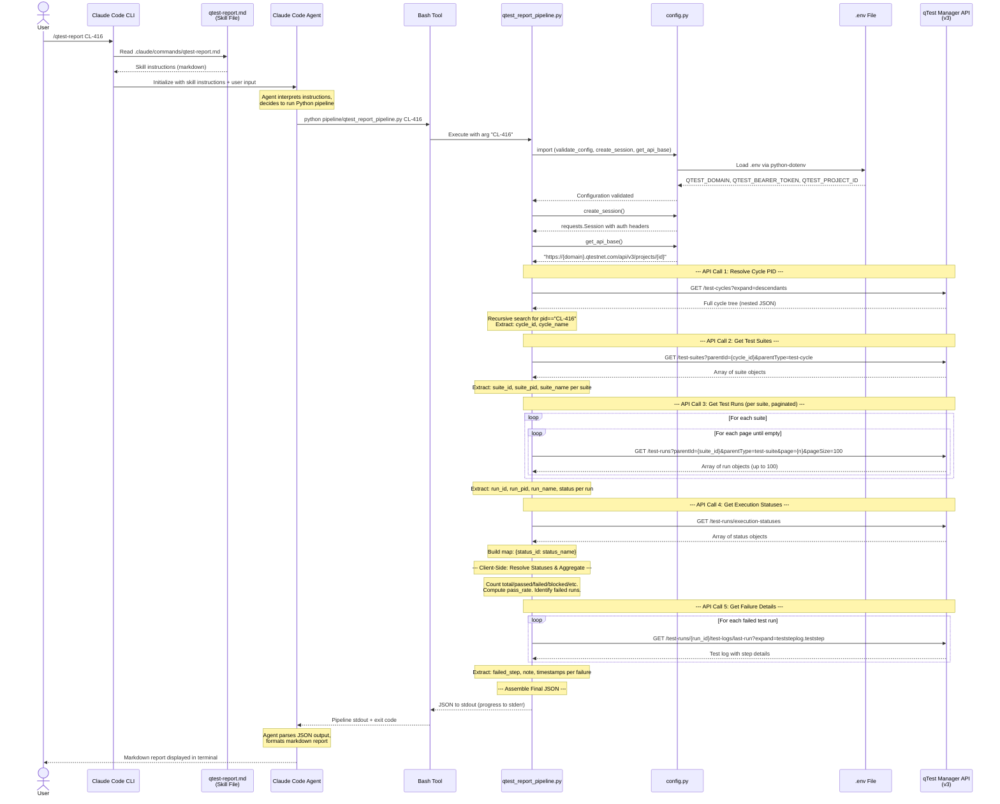
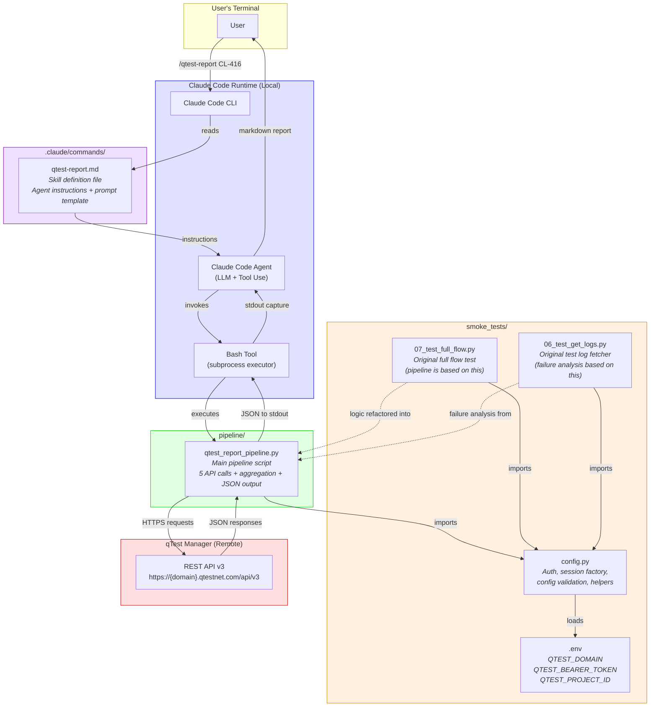

# Component Diagrams: `/qtest-report` Skill

This document provides visual representations of the skill's architecture at multiple levels of detail: an ASCII flow diagram for quick reference, a Mermaid sequence diagram showing API-level interactions, and a Mermaid component diagram showing file-level dependencies.

---

## 1. ASCII Flow Diagram

This diagram shows the end-to-end flow from user invocation to report output.

```
    LOCAL MACHINE                                         NETWORK
    ============                                         =======

    User types "/qtest-report CL-416"
      |
      v
    +-----------------------------+
    | Claude Code CLI             |
    | (loads skill definition)    |
    +-----------------------------+
      |
      | reads .claude/commands/qtest-report.md
      v
    +-----------------------------+
    | Claude Code Agent           |
    | (interprets instructions)   |
    +-----------------------------+
      |
      | executes via Bash tool:
      | python pipeline/qtest_report_pipeline.py CL-416
      v
    +-----------------------------+
    | Python Pipeline             |
    | qtest_report_pipeline.py    |
    +-----------------------------+
      |
      | imports
      v
    +-----------------------------+
    | config.py                   |         +--------------------------+
    | - loads .env                |         |                          |
    | - validate_config()         |         |  qTest Manager REST API  |
    | - create_session()          |         |  (v3)                    |
    | - get_api_base()            |         |                          |
    +-----------------------------+         |  Endpoints:              |
      |                                     |  /test-cycles            |
      | authenticated session               |  /test-suites            |
      |                                     |  /test-runs              |
      v                                     |  /execution-statuses     |
    +-----------------------------+  HTTPS  |  /test-logs/last-run     |
    | API Call 1: GET test-cycles |-------->|                          |
    |   (resolve CL-416 -> ID)   |<--------|                          |
    +-----------------------------+         |                          |
      |                                     |                          |
    +-----------------------------+         |                          |
    | API Call 2: GET test-suites |-------->|                          |
    |   (suites under cycle)     |<--------|                          |
    +-----------------------------+         |                          |
      |                                     |                          |
    +-----------------------------+         |                          |
    | API Call 3: GET test-runs   |-------->|                          |
    |   (per suite, paginated)   |<--------|                          |
    +-----------------------------+         |                          |
      |                                     |                          |
    +-----------------------------+         |                          |
    | API Call 4: GET exec-status |-------->|                          |
    |   (status ID -> name map)  |<--------|                          |
    +-----------------------------+         |                          |
      |                                     |                          |
    +-----------------------------+         |                          |
    | API Call 5: GET test-logs   |-------->|                          |
    |   (per failed run only)    |<--------|                          |
    +-----------------------------+         +--------------------------+
      |
      | aggregation + JSON assembly
      v
    +-----------------------------+
    | JSON output to stdout       |
    | (progress to stderr)        |
    +-----------------------------+
      |
      | agent captures stdout
      v
    +-----------------------------+
    | Claude Code Agent           |
    | (parses JSON, formats MD)   |
    +-----------------------------+
      |
      v
    +-----------------------------+
    | Markdown report displayed   |
    | to user in terminal         |
    +-----------------------------+
```

### Boundary Summary

| Boundary | What Crosses It |
|----------|----------------|
| User -> Claude Code CLI | Slash command text: `/qtest-report CL-416` |
| CLI -> Agent | Skill definition file (`.claude/commands/qtest-report.md`) |
| Agent -> Python (Bash tool) | Shell command string; stdout/stderr streams back |
| Python -> config.py | Function imports (`create_session`, `get_api_base`, `validate_config`) |
| config.py -> .env file | Environment variable reads (filesystem I/O) |
| Python -> qTest API (NETWORK) | HTTPS requests with bearer token auth |
| Agent -> User | Formatted markdown text in terminal |

---

## 2. Mermaid Sequence Diagram

This diagram shows the temporal ordering of all interactions, including each individual API call.



### Reading the Sequence Diagram

- Solid arrows (`->>`) represent calls/requests.
- Dashed arrows (`-->>`) represent returns/responses.
- The `loop` boxes indicate repeated calls (pagination for runs, per-failure for logs).
- Everything above the `API` lifeline runs locally. Only the arrows crossing to `API` traverse the network.

---

## 3. Mermaid Component Diagram

This diagram shows the file-level architecture: which files exist, which modules import or invoke which other modules.



### Component Roles

| Component | Type | Role |
|-----------|------|------|
| `qtest-report.md` | Skill definition | Natural language instructions telling the agent how to invoke the pipeline and format results |
| `qtest_report_pipeline.py` | Python script | Data layer -- makes all API calls, performs aggregation, outputs JSON |
| `config.py` | Python module | Infrastructure -- auth, session management, environment config |
| `.env` | Configuration file | Secrets storage -- credentials, domain, project ID |
| Claude Code Agent | LLM runtime | Orchestration + presentation -- invokes pipeline, formats report |
| qTest Manager API | External service | Data source -- all test execution data |
| `07_test_full_flow.py` | Smoke test | Ancestor -- pipeline refactors logic from this file |
| `06_test_get_logs.py` | Smoke test | Ancestor -- failure log fetching comes from this file |

### Dependency Direction

Dependencies flow downward and inward:

```
Agent --> Skill File (reads instructions)
Agent --> Pipeline (invokes via Bash)
Pipeline --> config.py (imports functions)
config.py --> .env (reads environment)
Pipeline --> qTest API (HTTPS calls)
```

No component has a reverse dependency. The pipeline does not know about the agent. `config.py` does not know about the pipeline. The API does not know about any of them. This makes each layer independently testable.

### Network Boundary

```
+-------------------------------------------------------+
|                    LOCAL MACHINE                        |
|                                                        |
|  User <-> CLI <-> Agent <-> Bash <-> Pipeline          |
|                                         |              |
|                                    config.py <-> .env  |
|                                         |              |
+--------- - - - - - - - - - - - - - - - | - - ---------+
                                          | HTTPS
                                          v
                              +---------------------+
                              | qTest Manager API   |
                              | (remote server)     |
                              +---------------------+
```

Only the Python pipeline crosses the network boundary. All other interactions are local: filesystem reads, subprocess execution, and stdout/stderr streaming.
