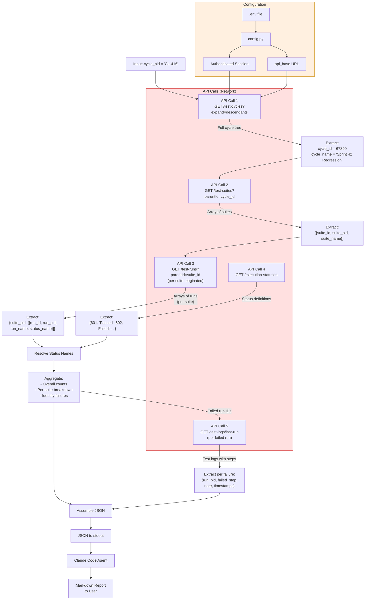

# Data Flow: `/qtest-report` Skill

This document traces every data transformation from the moment the user provides a cycle PID to the moment the final markdown report is displayed. Each stage documents what comes in, what the API returns, what gets extracted, and what gets discarded.

---

## ASCII Data Flow Overview

```
INPUT                API CALLS (network)              CLIENT-SIDE              OUTPUT
=====                ===================              ===========              ======

"CL-416"
   |
   v
+-----------+    GET test-cycles?expand=descendants
| Resolve   |------------------------------------------->  qTest API
| Cycle PID |<-------------------------------------------
+-----------+    Full cycle tree (nested)
   |
   | Extract: {cycle_id: 67890, cycle_name, cycle_pid}
   | Discard: all other cycles, web_url, links, order, dates
   v
+-----------+    GET test-suites?parentId=67890&parentType=test-cycle
| Get       |------------------------------------------->  qTest API
| Suites    |<-------------------------------------------
+-----------+    Array of suite objects
   |
   | Extract: [{suite_id, suite_pid, suite_name}, ...]
   | Discard: properties, links, dates, descriptions, order
   v
+-----------+    GET test-runs?parentId={suiteId}&parentType=test-suite
| Get Runs  |------------------------------------------->  qTest API (per suite)
| (per      |<------------------------------------------- (paginated, may repeat)
|  suite)   |
+-----------+    Arrays of run objects per suite
   |
   | Extract: {suite_pid: [{run_id, run_pid, run_name, status_name}, ...]}
   | Discard: test_case details, assigned_to, dates, links, descriptions
   v
+-----------+    GET test-runs/execution-statuses
| Get       |------------------------------------------->  qTest API
| Statuses  |<-------------------------------------------
+-----------+    Array of status objects
   |
   | Extract: {status_id: status_name} map
   | Used to resolve numeric IDs from previous step
   v
+-----------+    Identify failed runs
| Filter    |    (status_name matches "Failed")
| Failures  |
+-----------+
   |
   v
+-----------+    GET test-runs/{runId}/test-logs/last-run?expand=teststeplog.teststep
| Get Fail  |------------------------------------------->  qTest API (per failure)
| Details   |<-------------------------------------------
+-----------+    Test log with step details
   |
   | Extract: {run_pid, status, failed_step, note, timestamps}
   | Discard: attachments, submitter details, links, passing steps
   v
+-----------+
| Aggregate |    Count totals, compute pass_rate,
| & Assemble|    build per-suite breakdown
+-----------+
   |
   v
+-----------+
| JSON to   |    Single JSON document on stdout
| stdout    |
+-----------+
   |
   v
+-----------+
| Agent     |    Parse JSON, format markdown tables,
| Formats   |    add failure analysis section
+-----------+
   |
   v
+-----------+
| Markdown  |    Report displayed to user
| Report    |
+-----------+
```

---

## Stage-by-Stage Data Transformations

### Stage 1: Input

**Input:** A test cycle PID string provided by the user.

```
"CL-416"
```

This is the only input to the pipeline. Everything else is derived from configuration (`config.py` / `.env`).

**Configuration values consumed at this stage:**

| Variable | Example | Source |
|----------|---------|--------|
| `QTEST_DOMAIN` | `"mycompany"` | `.env` |
| `QTEST_BEARER_TOKEN` | `"aaaabbbb-cccc-..."` | `.env` |
| `QTEST_PROJECT_ID` | `"12345"` | `.env` |

**Derived value:**

```
api_base = "https://mycompany.qtestnet.com/api/v3/projects/12345"
```

---

### Stage 2: API Call 1 -- Resolve Cycle PID

**Request:**

```
GET {api_base}/test-cycles?expand=descendants
Authorization: Bearer {token}
```

**Full Response Structure** (simplified, showing nesting):

```json
[
  {
    "id": 11111,
    "pid": "CL-400",
    "name": "Release 5.0",
    "order": 1,
    "web_url": "https://...",
    "created_date": "2025-01-15T...",
    "last_modified_date": "2025-03-01T...",
    "links": [...],
    "test_cycles": [
      {
        "id": 67890,
        "pid": "CL-416",
        "name": "Sprint 42 Regression",
        "order": 3,
        "web_url": "https://...",
        "created_date": "2025-03-10T...",
        "last_modified_date": "2025-03-22T...",
        "links": [...],
        "test_cycles": []
      },
      {
        "id": 67891,
        "pid": "CL-417",
        "name": "Sprint 42 Smoke",
        "...": "..."
      }
    ]
  }
]
```

**Extraction Logic:**

Recursive search through the nested `test_cycles` arrays. For each node, check if `node["pid"] == target_pid`. Return the first match.

**Extracted Data:**

```json
{
  "cycle_id": 67890,
  "cycle_name": "Sprint 42 Regression",
  "cycle_pid": "CL-416"
}
```

**Discarded Data:**

- All cycles that do not match the target PID.
- Fields: `web_url`, `links`, `order`, `created_date`, `last_modified_date`.
- The entire rest of the cycle tree (sibling cycles, parent cycles, unrelated branches).

**Error Case:** If no cycle matches the PID, the pipeline exits with a non-zero code and an error message to stderr.

---

### Stage 3: API Call 2 -- Get Test Suites

**Request:**

```
GET {api_base}/test-suites?parentId=67890&parentType=test-cycle
Authorization: Bearer {token}
```

**Full Response Structure:**

```json
[
  {
    "id": 80001,
    "pid": "TS-201",
    "name": "Login Module",
    "order": 1,
    "description": "All login-related test cases...",
    "web_url": "https://...",
    "created_date": "2025-03-10T...",
    "last_modified_date": "2025-03-22T...",
    "properties": [...],
    "links": [...]
  },
  {
    "id": 80002,
    "pid": "TS-202",
    "name": "Checkout Flow",
    "order": 2,
    "description": "End-to-end checkout tests...",
    "...": "..."
  }
]
```

**Extracted Data:**

```json
[
  {"suite_id": 80001, "suite_pid": "TS-201", "suite_name": "Login Module"},
  {"suite_id": 80002, "suite_pid": "TS-202", "suite_name": "Checkout Flow"}
]
```

**Discarded Data:**

- Fields: `description`, `web_url`, `created_date`, `last_modified_date`, `properties`, `links`, `order`.

---

### Stage 4: API Call 3 -- Get Test Runs (Per Suite, Paginated)

**Request (repeated per suite, per page):**

```
GET {api_base}/test-runs?parentId=80001&parentType=test-suite&page=1&pageSize=100
Authorization: Bearer {token}
```

**Pagination Logic:**

For each suite, the pipeline requests page 1. If the response contains 100 items (equal to `pageSize`), it requests page 2, and so on, until a response returns fewer than `pageSize` items or an empty array.

Additionally, the pipeline fetches runs directly under the cycle (not inside any suite):

```
GET {api_base}/test-runs?parentId=67890&parentType=test-cycle&page=1&pageSize=100
```

**Full Response Structure** (single page, showing one run):

```json
[
  {
    "id": 990001,
    "pid": "TR-5001",
    "name": "TC-Login with valid credentials",
    "order": 1,
    "test_case": {
      "id": 55001,
      "pid": "TC-1001",
      "name": "Login with valid credentials"
    },
    "assigned_to": "user@company.com",
    "created_date": "2025-03-10T...",
    "last_modified_date": "2025-03-22T...",
    "links": [...],
    "properties": [
      {
        "field_id": 12345,
        "field_name": "Status",
        "field_value": 601,
        "field_value_name": "Passed"
      },
      {
        "field_id": 12346,
        "field_name": "Priority",
        "field_value": 1,
        "field_value_name": "High"
      }
    ],
    "latest_test_log": {
      "id": 770001,
      "status": {"id": 601, "name": "Passed"},
      "exe_start_date": "2025-03-22T08:00:00Z",
      "exe_end_date": "2025-03-22T08:01:30Z"
    }
  }
]
```

**Status Extraction Logic:**

The execution status can appear in three different locations depending on the qTest version and configuration. The pipeline checks them in priority order:

1. **`properties` array** -- Look for a property where `field_name` (or `label`) equals `"Status"` (case-insensitive). If found, use `field_value_name` as the status string. If `field_value_name` is absent, use `field_value` as a numeric ID and resolve it via the status map.

2. **`latest_test_log.status`** -- If properties did not yield a status, check `run["latest_test_log"]["status"]["name"]`. Fall back to resolving `status["id"]` via the status map.

3. **`exe_status` field** -- Some qTest versions expose a top-level `exe_status` field containing a numeric status ID. Resolve via the status map.

4. **Default** -- If none of the above yield a result, the status is recorded as `"Unknown"`.

**Extracted Data:**

```json
{
  "TS-201": [
    {"run_id": 990001, "run_pid": "TR-5001", "run_name": "TC-Login with valid credentials", "status_name": "Passed"},
    {"run_id": 990002, "run_pid": "TR-5002", "run_name": "TC-Login with invalid password", "status_name": "Failed"},
    {"run_id": 990003, "run_pid": "TR-5003", "run_name": "TC-Login with expired session", "status_name": "Passed"}
  ],
  "TS-202": [
    {"run_id": 990010, "run_pid": "TR-5010", "run_name": "TC-Add item to cart", "status_name": "Passed"},
    {"run_id": 990011, "run_pid": "TR-5011", "run_name": "TC-Apply coupon code", "status_name": "Blocked"},
    {"run_id": 990012, "run_pid": "TR-5012", "run_name": "TC-Complete purchase", "status_name": "Unexecuted"}
  ]
}
```

**Discarded Data:**

- Fields: `test_case` (full object), `assigned_to`, `created_date`, `last_modified_date`, `links`, `order`.
- Non-status properties (e.g., Priority, Assigned To, Environment).
- The full `latest_test_log` object (only the status is extracted at this stage; the full log is fetched separately for failures in API Call 5).

---

### Stage 5: API Call 4 -- Get Execution Statuses

**Request:**

```
GET {api_base}/test-runs/execution-statuses
Authorization: Bearer {token}
```

**Full Response Structure:**

```json
[
  {"id": 601, "name": "Passed", "is_default": false},
  {"id": 602, "name": "Failed", "is_default": false},
  {"id": 603, "name": "Blocked", "is_default": false},
  {"id": 604, "name": "Incomplete", "is_default": false},
  {"id": 605, "name": "Unexecuted", "is_default": true}
]
```

**Extracted Data:**

```json
{
  "601": "Passed",
  "602": "Failed",
  "603": "Blocked",
  "604": "Incomplete",
  "605": "Unexecuted"
}
```

This map is used retroactively to resolve any numeric status IDs encountered in Stage 4 that did not have a `field_value_name` string.

**Discarded Data:**

- Fields: `is_default`.
- Any other metadata on the status objects.

---

### Stage 6: API Call 5 -- Get Failure Details (Failed Runs Only)

**Trigger:** This call is made once for each test run whose resolved status is `"Failed"`. If there are zero failures, this stage is skipped entirely.

**Request (per failed run):**

```
GET {api_base}/test-runs/990002/test-logs/last-run?expand=teststeplog.teststep
Authorization: Bearer {token}
```

The `expand=teststeplog.teststep` parameter tells qTest to include full step-level detail in the response.

**Full Response Structure:**

```json
{
  "id": 770050,
  "status": {
    "id": 602,
    "name": "Failed"
  },
  "exe_start_date": "2025-03-22T08:15:00Z",
  "exe_end_date": "2025-03-22T08:16:45Z",
  "note": "Password validation error message did not match expected text.",
  "submitter": {
    "id": 999,
    "name": "Jane Doe"
  },
  "attachments": [...],
  "links": [...],
  "test_step_logs": [
    {
      "order": 1,
      "description": "Navigate to login page",
      "expected_result": "Login page loads",
      "actual_result": "Login page loaded successfully",
      "status": "Passed"
    },
    {
      "order": 2,
      "description": "Enter invalid password and click Submit",
      "expected_result": "Error message: 'Invalid password. Please try again.'",
      "actual_result": "Error message: 'Authentication failed'",
      "status": "Failed"
    },
    {
      "order": 3,
      "description": "Verify error count badge",
      "expected_result": "Badge shows 1 error",
      "actual_result": "",
      "status": "Unexecuted"
    }
  ]
}
```

**Extraction Logic for Failed Step:**

Iterate through `test_step_logs` in order. The "failed step" is the first step where `status != "Passed"`. This captures the point of failure rather than downstream unexecuted steps.

**Extracted Data (per failure):**

```json
{
  "run_id": 990002,
  "run_pid": "TR-5002",
  "run_name": "TC-Login with invalid password",
  "suite_pid": "TS-201",
  "status": "Failed",
  "failed_step": {
    "order": 2,
    "description": "Enter invalid password and click Submit",
    "expected_result": "Error message: 'Invalid password. Please try again.'",
    "actual_result": "Error message: 'Authentication failed'"
  },
  "note": "Password validation error message did not match expected text.",
  "exe_start_date": "2025-03-22T08:15:00Z",
  "exe_end_date": "2025-03-22T08:16:45Z"
}
```

**Discarded Data:**

- Fields: `submitter`, `attachments`, `links`, `id` (the log ID itself).
- All passing steps (only the first non-passing step is extracted).
- Steps after the failure point (typically unexecuted).

**Edge Cases:**

- If a failed run has no test logs (404 response), the failure is recorded without step details (`failed_step: null`).
- If all steps show "Passed" despite the run being marked "Failed" (data inconsistency), `failed_step` is set to `null` and a note is added.

---

### Stage 7: Client-Side Aggregation

After all API calls complete, the pipeline computes aggregate statistics from the collected data.

**Overall Counts:**

```json
{
  "total": 6,
  "passed": 3,
  "failed": 1,
  "blocked": 1,
  "incomplete": 0,
  "unexecuted": 1,
  "pass_rate": 50.0
}
```

Computation:
- Each status count is derived from the resolved `status_name` values across all runs.
- `pass_rate` = `(passed / total) * 100`, rounded to one decimal place.
- The `total` should equal the sum of all individual status counts.

**Per-Suite Breakdown:**

```json
[
  {
    "suite_pid": "TS-201",
    "suite_name": "Login Module",
    "total": 3,
    "passed": 2,
    "failed": 1,
    "blocked": 0,
    "incomplete": 0,
    "unexecuted": 0,
    "pass_rate": 66.7
  },
  {
    "suite_pid": "TS-202",
    "suite_name": "Checkout Flow",
    "total": 3,
    "passed": 1,
    "failed": 0,
    "blocked": 1,
    "incomplete": 0,
    "unexecuted": 1,
    "pass_rate": 33.3
  }
]
```

**Failure Details Array:**

```json
[
  {
    "run_pid": "TR-5002",
    "run_name": "TC-Login with invalid password",
    "suite_pid": "TS-201",
    "suite_name": "Login Module",
    "failed_step": {
      "order": 2,
      "description": "Enter invalid password and click Submit",
      "expected_result": "Error message: 'Invalid password. Please try again.'",
      "actual_result": "Error message: 'Authentication failed'"
    },
    "note": "Password validation error message did not match expected text.",
    "exe_start_date": "2025-03-22T08:15:00Z",
    "exe_end_date": "2025-03-22T08:16:45Z"
  }
]
```

---

### Stage 8: Final JSON Output Schema

This is the complete JSON document that the pipeline writes to stdout. The agent consumes this document to produce the report.

```json
{
  "cycle": {
    "pid": "CL-416",
    "id": 67890,
    "name": "Sprint 42 Regression"
  },
  "summary": {
    "total": 6,
    "passed": 3,
    "failed": 1,
    "blocked": 1,
    "incomplete": 0,
    "unexecuted": 1,
    "pass_rate": 50.0
  },
  "suites": [
    {
      "pid": "TS-201",
      "id": 80001,
      "name": "Login Module",
      "total": 3,
      "passed": 2,
      "failed": 1,
      "blocked": 0,
      "incomplete": 0,
      "unexecuted": 0,
      "pass_rate": 66.7
    },
    {
      "pid": "TS-202",
      "id": 80002,
      "name": "Checkout Flow",
      "total": 3,
      "passed": 1,
      "failed": 0,
      "blocked": 1,
      "incomplete": 0,
      "unexecuted": 1,
      "pass_rate": 33.3
    }
  ],
  "failures": [
    {
      "run_pid": "TR-5002",
      "run_id": 990002,
      "run_name": "TC-Login with invalid password",
      "suite_pid": "TS-201",
      "suite_name": "Login Module",
      "status": "Failed",
      "failed_step": {
        "order": 2,
        "description": "Enter invalid password and click Submit",
        "expected_result": "Error message: 'Invalid password. Please try again.'",
        "actual_result": "Error message: 'Authentication failed'"
      },
      "note": "Password validation error message did not match expected text.",
      "exe_start_date": "2025-03-22T08:15:00Z",
      "exe_end_date": "2025-03-22T08:16:45Z"
    }
  ],
  "metadata": {
    "generated_at": "2025-03-23T09:30:00Z",
    "project_id": "12345",
    "api_base": "https://mycompany.qtestnet.com/api/v3/projects/12345",
    "api_calls_made": 8,
    "execution_time_seconds": 4.2
  }
}
```

**Schema Notes:**

| Field | Type | Always Present | Notes |
|-------|------|----------------|-------|
| `cycle` | object | Yes | Contains `pid`, `id`, `name` |
| `summary` | object | Yes | Contains all status counts and `pass_rate` |
| `suites` | array | Yes | May be empty if cycle has no suites |
| `suites[].pass_rate` | float | Yes | 0.0 if total is 0 |
| `failures` | array | Yes | Empty array if no failures |
| `failures[].failed_step` | object or null | Yes | Null if no step detail available |
| `failures[].note` | string or null | Yes | Null if executor left no note |
| `metadata` | object | Yes | Pipeline execution metadata |
| `metadata.api_calls_made` | int | Yes | Total HTTP requests (varies with pagination and failure count) |

---

### Stage 9: Final Markdown Report

The Claude Code agent transforms the JSON into a markdown report. This is not done by the Python pipeline -- the agent handles formatting based on instructions in the skill definition file.

**Example output:**

```markdown
# Test Execution Report: Sprint 42 Regression (CL-416)

**Generated:** 2025-03-23 09:30 UTC

## Summary

| Metric | Value |
|--------|-------|
| Total Test Runs | 6 |
| Passed | 3 (50.0%) |
| Failed | 1 (16.7%) |
| Blocked | 1 (16.7%) |
| Unexecuted | 1 (16.7%) |
| **Pass Rate** | **50.0%** |

## Suite Breakdown

| Suite | Total | Passed | Failed | Blocked | Unexecuted | Pass Rate |
|-------|-------|--------|--------|---------|------------|-----------|
| TS-201 Login Module | 3 | 2 | 1 | 0 | 0 | 66.7% |
| TS-202 Checkout Flow | 3 | 1 | 0 | 1 | 1 | 33.3% |

## Failure Analysis

### TR-5002: TC-Login with invalid password
- **Suite:** TS-201 Login Module
- **Failed Step:** Step 2 -- Enter invalid password and click Submit
  - **Expected:** Error message: 'Invalid password. Please try again.'
  - **Actual:** Error message: 'Authentication failed'
- **Note:** Password validation error message did not match expected text.
- **Executed:** 2025-03-22 08:15 - 08:16 UTC
```

**Formatting rules applied by the agent:**

1. The report title includes the cycle name and PID.
2. Summary table shows counts with percentages in parentheses.
3. Pass rate is bold in the summary.
4. Suite breakdown is a single table, one row per suite.
5. Each failure gets its own subsection with run PID in the heading.
6. Failed step details show expected vs. actual as indented bullets.
7. Timestamps are formatted as human-readable UTC.
8. If there are no failures, the "Failure Analysis" section reads "No failures detected."

---

## Mermaid Data Flow Diagram



---

## Data Volume Estimates

Understanding data volumes helps anticipate API latency and output size.

| Stage | Typical Volume | Worst Case |
|-------|---------------|------------|
| API Call 1 response | 50-500 KB (depends on total cycles in project) | 2 MB+ for projects with thousands of cycles |
| API Call 2 response | 1-20 suites | 50+ suites |
| API Call 3 responses | 10-200 runs per suite, 1-3 pages | 1000+ runs, 10+ pages per suite |
| API Call 4 response | 5-10 statuses | 20 statuses |
| API Call 5 responses | 0-20 failed runs | 100+ failures |
| Final JSON output | 2-20 KB | 200+ KB |
| API calls total | 5-10 | 50+ (pagination + many failures) |
| Wall clock time | 2-5 seconds | 30+ seconds |

The main variable is the number of test runs (drives pagination in Call 3) and the number of failures (drives repetitions of Call 5).
