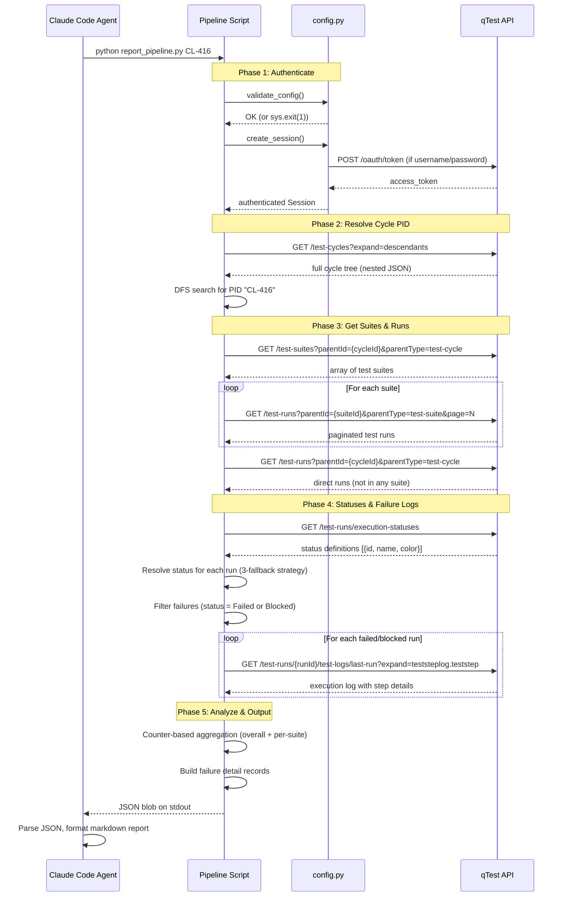

# Pipeline Overview

The qTest Report Skill pipeline is a 5-phase Python script that fetches test execution data from qTest Manager and outputs structured JSON to stdout. The Claude Code agent then reads this JSON and formats it into a markdown morning report.

## Architecture Principle

**The pipeline outputs JSON to stdout. The agent (not the script) formats the markdown.**

This separation keeps the Python code testable and deterministic, while letting the agent adapt the report format, tone, and level of detail without touching any code. The pipeline is a pure data-extraction layer; the agent is the presentation layer.

---

## Pipeline Flow (ASCII)

```
[Input: CL-416]
    |
    v
Phase 1: Authenticate
    |  Reuses: config.py -> create_session(), validate_config()
    |  Output: authenticated requests.Session
    v
Phase 2: Resolve Cycle PID
    |  API: GET /test-cycles?expand=descendants
    |  Output: {cycle_id, cycle_name}
    v
Phase 3: Get Suites & Runs
    |  API: GET /test-suites + GET /test-runs (paginated, per suite)
    |  Output: {suite_pid: [runs...], ...}
    v
Phase 4: Get Statuses & Failure Logs
    |  API: GET /execution-statuses + GET /test-logs/last-run (failures only)
    |  Output: status_map + enriched failure details
    v
Phase 5: Analyze & Output JSON
    |  Aggregation: Counter-based stats
    |  Output: JSON blob to stdout
    v
[Agent reads JSON, formats markdown report]
```

---

## Sequence Diagram (Mermaid)



---

## Phase Summary Table

| Phase | Name | API Calls | Input | Output | Can Fail Gracefully? |
|-------|------|-----------|-------|--------|----------------------|
| 1 | Authenticate | 0 or 1 (OAuth token exchange if using username/password) | `.env` environment variables | Authenticated `requests.Session` | No -- missing config or bad credentials are fatal |
| 2 | Resolve Cycle PID | 1 (`GET /test-cycles?expand=descendants`) | `cycle_pid` string (e.g., "CL-416") | `{cycle_id, cycle_name, cycle_pid}` | No -- unknown PID is fatal (lists available PIDs in error) |
| 3 | Get Suites & Runs | 2 + N (1 for suites, N paginated calls per suite, 1 for direct runs) | `cycle_id` from Phase 2 | `{suite_pid: [run_objects], "(direct)": [run_objects]}` | Yes -- empty cycle produces a valid report with zero counts |
| 4 | Get Statuses & Failure Logs | 1 + F (1 for status definitions, F calls for each failed/blocked run) | All runs from Phase 3 | `status_map` + enriched failure detail records | Yes -- 404 on a test log is skipped; missing step details noted |
| 5 | Analyze & Output JSON | 0 (pure computation) | Runs + statuses + failure details | JSON blob on stdout | No -- this is deterministic computation; if it fails, it is a bug |

### Typical API call count

For a cycle with 5 suites and ~200 runs, 7 of which are failed or blocked:

- Phase 1: 0-1 calls
- Phase 2: 1 call
- Phase 3: 1 (suites) + 5 (runs per suite, 1 page each) + 1 (direct runs) = 7 calls
- Phase 4: 1 (statuses) + 7 (failure logs) = 8 calls
- Phase 5: 0 calls

**Total: 16-17 API calls**, completing in roughly 5-10 seconds depending on qTest response times.

---

## Code Reuse Map

The pipeline reuses proven code from `smoke_tests/`:

| Function | Source File | Lines | Used In |
|----------|-------------|-------|---------|
| `validate_config()` | `config.py` | 34-53 | Phase 1 |
| `create_session()` | `config.py` | 61-96 | Phase 1 |
| `get_api_base()` | `config.py` | 56-58 | All phases |
| `resolve_cycle_pid()` | `07_test_full_flow.py` | 28-42 | Phase 2 |
| `get_test_suites()` | `07_test_full_flow.py` | 45-52 | Phase 3 |
| `get_test_runs_paginated()` | `07_test_full_flow.py` | 55-85 | Phase 3 |
| `get_execution_statuses()` | `07_test_full_flow.py` | 88-92 | Phase 4 |
| `extract_status_from_run()` | `07_test_full_flow.py` | 95-133 | Phase 4 |
| `get_latest_test_log()` | `06_test_get_logs.py` | 24-37 | Phase 4 (new integration) |

The only truly new code in the pipeline is:
1. The failure-enrichment loop (calling `get_latest_test_log()` per failed run)
2. The JSON output assembly in Phase 5
3. The pass-rate calculation logic

---

## Error Strategy

- **Fatal errors** (missing config, bad auth, unknown PID): exit code 1, error message on stderr.
- **Graceful degradation** (404 on a test log, empty suites, missing step details): continue execution, include notes in `data_collection_issues` array in the output JSON.
- **The agent checks exit code first.** If non-zero, it reads stderr and reports the error to the user instead of trying to parse JSON.
