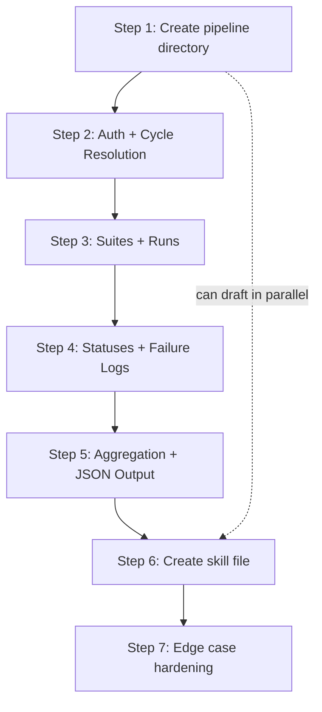

# Build Order

Step-by-step implementation sequence with dependencies.

---

## Dependency Graph



**Critical path:** Steps 1 → 2 → 3 → 4 → 5 → 6 → 7 (sequential)
**Parallelizable:** Skill file drafting (Step 6) can begin alongside Steps 3-4

---

## Step 1: Create Pipeline Directory and Module Structure

**Action:** Create the pipeline directory and entry point file.

```
pipeline/
├── __init__.py                    # empty
└── qtest_report_pipeline.py       # main entry point
```

**Details:**
- `qtest_report_pipeline.py` accepts a cycle PID as a CLI argument
- Adds `smoke_tests/` to `sys.path` to import from `config.py`
- Skeleton: argument parsing, import validation, main() function

**Dependency:** None
**Test:** `python pipeline/qtest_report_pipeline.py --help` prints usage

---

## Step 2: Implement Phases 1-2 (Auth + Cycle Resolution)

**Action:** Wire up authentication and PID resolution.

**Code to write:**
```python
import sys
import os

# Add smoke_tests to path for config import
sys.path.insert(0, os.path.join(os.path.dirname(__file__), '..', 'smoke_tests'))
from config import validate_config, create_session, get_api_base

def resolve_cycle_pid(session, api_base, target_pid):
    """Reuse logic from 07_test_full_flow.py lines 28-42"""
    resp = session.get(f"{api_base}/test-cycles", params={"expand": "descendants"})
    resp.raise_for_status()

    def search(items):
        for c in items:
            if c.get("pid") == target_pid:
                return c
            found = search(c.get("test_cycles", []))
            if found:
                return found
        return None

    return search(resp.json())
```

**Reuses:**
- `validate_config()` from `config.py:34`
- `create_session()` from `config.py:61`
- `get_api_base()` from `config.py:56`
- `resolve_cycle_pid()` logic from `07_test_full_flow.py:28`

**Dependency:** Step 1
**Test:** Run with a valid PID, verify cycle info printed to stderr

---

## Step 3: Implement Phase 3 (Suites + Runs)

**Action:** Add suite retrieval and paginated run fetching.

**Code to write:**
- `get_test_suites(session, api_base, cycle_id)` — refactored from `07_test_full_flow.py:45`
- `get_test_runs_paginated(session, api_base, parent_id, parent_type)` — refactored from `07_test_full_flow.py:55`
- Loop over suites + fetch direct cycle runs

**Reuses:**
- `get_test_suites()` from `07_test_full_flow.py:45-52`
- `get_test_runs_paginated()` from `07_test_full_flow.py:55-85`

**Dependency:** Step 2
**Test:** Run pipeline, verify run counts match `07_test_full_flow.py` output

---

## Step 4: Implement Phase 4 (Statuses + Failure Logs)

**Action:** Add status resolution and the NEW failure log fetching.

**Code to write:**
- `get_execution_statuses(session, api_base)` — from `07_test_full_flow.py:88`
- `extract_status_from_run(run, status_map)` — from `07_test_full_flow.py:95`
- **NEW:** `get_failure_details(session, api_base, run, status_map)` — fetches test log for a single failed run, extracts failed step, note, timestamps

**New function based on `06_test_get_logs.py:24-37`:**
```python
def get_failure_details(session, api_base, run, suite_info):
    """Fetch test log for a failed/blocked run and extract failure details."""
    run_id = run["id"]
    try:
        resp = session.get(
            f"{api_base}/test-runs/{run_id}/test-logs/last-run",
            params={"expand": "teststeplog.teststep"},
            timeout=30
        )
        if resp.status_code == 404:
            return None  # No log — unexecuted
        resp.raise_for_status()
        log = resp.json()

        # Find first failed step
        failed_step = None
        for step in log.get("test_step_logs", []):
            if step.get("status", "").lower() != "passed":
                failed_step = {
                    "order": step.get("order"),
                    "description": step.get("description", ""),
                    "expected": step.get("expected_result", ""),
                    "actual": step.get("actual_result", "")
                }
                break

        return {
            "run_pid": run.get("pid"),
            "run_id": run_id,
            "run_name": run.get("name"),
            "suite_pid": suite_info.get("pid"),
            "suite_name": suite_info.get("name"),
            "status": extract_status_from_run(run, status_map),
            "failed_step": failed_step,
            "note": log.get("note", ""),
            "executed_at": log.get("exe_start_date", "")
        }
    except Exception as e:
        return None  # Log error but don't abort
```

**This is the key new capability** not present in any existing script.

**Reuses:**
- `get_execution_statuses()` from `07_test_full_flow.py:88-92`
- `extract_status_from_run()` from `07_test_full_flow.py:95-133`
- Log fetching pattern from `06_test_get_logs.py:24-37`

**Dependency:** Step 3
**Test:** Verify failure details populated for known failed runs

---

## Step 5: Implement Phase 5 (Aggregation + JSON Output)

**Action:** Build aggregation logic and produce the final JSON output.

**Code to write:**
- `aggregate_stats(all_runs, suite_runs, status_map)` — uses `collections.Counter`
- `build_output(cycle, suites, stats, failures, blocked, issues)` — constructs the output dict
- `print(json.dumps(output))` to stdout

**Output must match the JSON schema in `04-skill-design/input-output-contract.md`.**

**Key computation:**
```python
pass_rate = (passed / executed * 100) if executed > 0 else 0
# where executed = total - unexecuted
```

**Reuses:**
- Counter-based aggregation from `07_test_full_flow.py:206-223`

**Dependency:** Step 4
**Test:** Run full pipeline, validate JSON output against schema, compare counts with `07_test_full_flow.py`

---

## Step 6: Create the Skill File

**Action:** Create `.claude/commands/qtest-report.md`

**Contents:**
- Skill description and purpose
- `$ARGUMENTS` placeholder for cycle PID
- Step-by-step agent instructions:
  1. If no arguments, ask for cycle PID
  2. Run the pipeline via Bash
  3. Handle errors
  4. Parse JSON from stdout
  5. Format the markdown report using the embedded template
  6. Present to user
- Embedded report template
- Follow-up capability descriptions

**Dependency:** Step 5 (but can start drafting in parallel with Steps 3-4)
**Test:** Invoke `/qtest-report CL-416` in Claude Code

---

## Step 7: Edge Case Hardening

**Action:** Handle all edge cases gracefully.

| Edge Case | Implementation |
|-----------|---------------|
| Empty cycle (0 suites) | Report says "No test suites found under this cycle" |
| All passing (0 failures) | Failure Analysis says "No failures detected" |
| Large cycle (500+ runs) | Pagination already handles it; add progress to stderr |
| Rate limited (429) | Retry once after `Retry-After` seconds, then abort |
| Network timeout | 30-second timeout per call, abort with clear message |
| Partial failure | Include available data, log issues in `data_collection_issues` |
| Failure log cap | Cap at 20 detailed failure logs to avoid rate limiting |
| Custom statuses | Handle dynamically in `other_statuses` dict |

**Dependency:** Step 6
**Test:** Run edge case test matrix from `testing-strategy.md`

---

## Estimated File Changes

| File | Action | Lines (est.) |
|------|--------|-------------|
| `pipeline/__init__.py` | Create | 1 |
| `pipeline/qtest_report_pipeline.py` | Create | ~250 |
| `.claude/commands/qtest-report.md` | Create | ~120 |
| **Total new code** | | **~370 lines** |

**No modifications to existing files.** The pipeline is entirely additive — existing smoke tests remain unchanged.

---

## Estimated Implementation Time

| Step | Scope |
|------|-------|
| Step 1 | Scaffold — minutes |
| Step 2 | Mostly refactoring existing code |
| Step 3 | Mostly refactoring existing code |
| Step 4 | New code (failure log fetching) — core new feature |
| Step 5 | Aggregation + JSON construction |
| Step 6 | Skill file authoring |
| Step 7 | Edge cases and polish |
