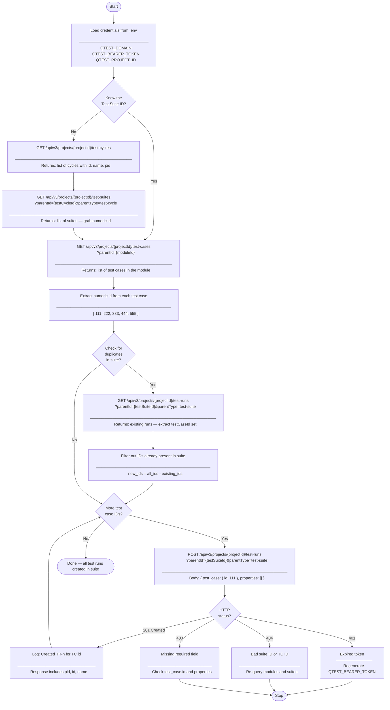

# Add Test Cases to Suite — Flow Diagram



---

## Key Decision Points

| Diamond | What it controls |
|---|---|
| **Know the Test Suite ID?** | Skip the cycle/suite lookup if ID is already known or hardcoded in `.env` |
| **Check for duplicates?** | Optional guard — skip if you know the suite is empty or don't mind duplicates |
| **More test case IDs?** | Loop continues until all IDs have been posted |
| **HTTP status?** | Determines success path vs error branch |

## Data Flow Summary

```
.env
 └─► BASE_URL + AUTH HEADERS
      │
      ├─► [optional] /test-cycles → /test-suites → testSuiteId
      │
      ├─► /test-cases?parentId={moduleId} → [ id, id, id, ... ]
      │
      ├─► [optional] /test-runs?parentId={suiteId} → existing ids → filter
      │
      └─► loop: POST /test-runs (one per id) → TR-1, TR-2, TR-3, ...
```
